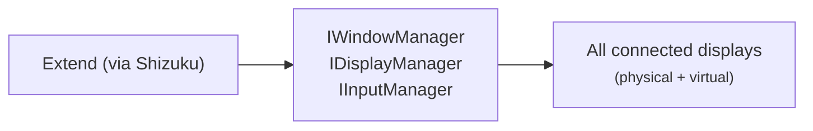

# Display Manager for Android

**Extend** is an all-purpose Android display manager for any connected physical or virtual display. It can be used standalone or alongside [**Mirror**](https://github.com/jqssun/android-display-mirror). It builds on top of Android desktop experience features, and allows you to place any application on any display and drive it with a built-in multi-touch virtual touchpad, an on-screen keyboard, a physical touchscreen, or any external input device connected to Android.

Combined with any supported launcher, it is a full open-source replacement for [Samsung DeX](https://www.samsung.com/us/apps/dex/), [Motorola Smart Connect Mobile Desktop (formerly Ready For)](https://www.motorola.com/we/en/motoverse/smart-connect), and Honor Easy Projection, with additional features on top.

<!--

-->

## Usage

Using without Shizuku is possible but outside the scope of support. For full feature compatibility, Shizuku is required: enable it in any supported mode (wireless debugging, USB debugging, or root) and grant access to this application. See [Shizuku documentation](https://shizuku.rikka.app/guide/setup/) for details.

### Using with Mirror

Extend manages physical and virtual displays while Mirror creates them. External displays are picked up automatically through built-in `DisplayManager` API. For screens that Android cannot reach natively, Mirror registers virtual displays in the same way so `DisplayManager` recognizes them without any extra integration.

## Compatibility

- Any device on Android 8.0+ (no privileged access required)
- An external display (connected via [DisplayPort over USB-C](https://www.displayport.org/displayport-over-usb-c/), [Wireless Display (Miracast)](https://www.android.com/articles/connect-phone-to-tv/), [Google Cast](https://www.android.com/better-together/google-cast/), [Samsung SmartView](https://www.samsung.com/us/support/owners/app/smart-view), or [any screen sharing application](https://developer.android.com/about/versions/14/features/app-screen-sharing))
- (Optional) [Mirror](https://github.com/jqssun/android-display-mirror/releases/latest) for additional support for creating virtual displays for screen sharing over AirPlay, [DisplayLink](https://www.synaptics.com/products/displaylink-graphics), [Moonlight](https://github.com/moonlight-stream)/[Sunshine](https://github.com/lizardbyte/sunshine) ([Nvidia GameStream](https://www.nvidia.com/en-us/support/gamestream/))
- (Optional) [Shizuku](https://github.com/RikkaApps/Shizuku/releases/latest) for hidden API access

## Features
- Launch any application on any external display in full screen
- Fully customizable resolution, scaling, DPI, and rotation for any display
- Reset any per-display configuration back to system defaults
- Built-in on-screen touchpad and keyboard for controlling any display
- Touchpad control with support for multi-touch, rotation, and digitizer-only mode
- Per-device routing from any external input device to any display
- Back and Home navigation for content running on external displays
- Turn off the built-in screen while keeping external displays active
- Managed virtual display mode with customizable on-screen keyboard routing and window behavior, for legacy Android versions

| Feature | Shizuku | Accessibility | Min. API |
|---|:---:|:---:|:---:|
| Change resolution | R | N | 26 |
| Change DPI | R | N | 26 |
| Change rotation | R | N | 26 |
| Change mode (FPS) | R | N | 26 |
| Bind input device | R | N | 26 (base)   29 (external device detection) |
| Managed virtual display | O | N | 26 (base)   33 (`TRUSTED` or `OWN_DISPLAY_GROUP`)   34 (`DEVICE_DISPLAY_GROUP`) |
| On-screen keyboard routing | R | N | 30 (`DisplayImePolicyCompat`) |
| On-screen touchpad overlay | R | R | 26 (`TYPE_ACCESSIBILITY_OVERLAY`)   30 (`getWindowsOnAllDisplays`) |
| Floating button | O | F | 26 (`TYPE_APPLICATION_OVERLAY` and `SYSTEM_ALERT_WINDOW`) |
| Built-in screen off | R | N | 26 (`SurfaceControl.setDisplayPowerMode`)   35 (`IDisplayManager.requestDisplayPower`) |
| Physical-key routing | R | N | 26 |
| Sharing logs | R | N | 26 (base)   30 (`MANAGE_EXTERNAL_STORAGE`) |
| Display hotplug monitor | I | N | 26 |
| Input hotplug monitor | I | N | 26 |

| Legend | |
|---|---|
| R | Required |
| O | Optional |
| F | Fallback |
| I | Inherited |
| N | Unused |

## Implementation

This application calls Android's built-in `IWindowManager`, `IDisplayManager`, and `IInputManager` services directly. Per-display configuration is applied with `setForcedDisplaySize`, `setForcedDisplayDensityForUser`, `freezeDisplayRotation`, `setDisplayImePolicy`, etc. Input routing goes through the `IInputManager` bridge to associate input devices with any specified display.

Check out the [CI](https://github.com/jqssun/android-display-extend/blob/main/.github/workflows/apk.yml) for help on how to create reproducible builds.

## Credits

- [Braden Farmer](https://github.com/farmerbb/SecondScreen) for the use of `IWindowManager` APIs in `SecondScreen`
- [Tao Wen](https://github.com/taowen) for the use of `IDisplayManager` APIs in `connect-screen`
- [Genymobile](https://github.com/Genymobile/scrcpy) for the use of `SurfaceControl` APIs in `scrcpy`
